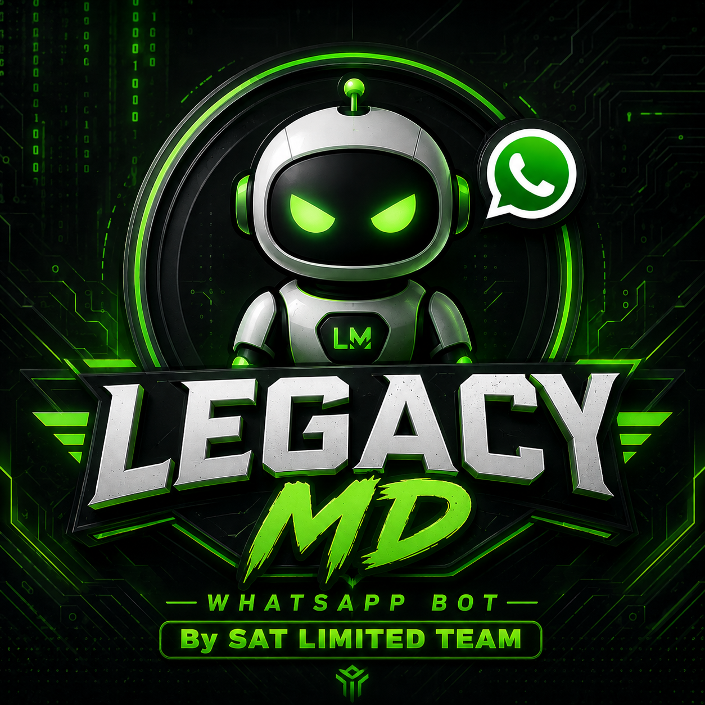

<div align="center">

# Legacy-MD

[](https://github.com/WhiskeySockets/Baileys)
[](https://nodejs.org/)
[](LICENSE)

<div align="center"> 
  <a href="https://git.io/typing-svg"> 
    
  </a> 
</div> 



</div>

A bot built from the past, carrying the history of what came before and improving on it.

> **A fast, powerful, and modern WhatsApp Multi-Device bot.**

Developed and maintained by **SAT Limited**

---

## 📖 About

**Legacy MD** is a feature-rich WhatsApp Multi-Device bot focused on performance, reliability, and ease of use. It combines utilities, AI, media tools, group management, and entertainment into one extensible project.

## ✨ Features

- 🤖 WhatsApp Multi-Device support
- 🧠 AI integrations
- 🎵 Media downloaders
- 🖼️ Image search
- 🔊 Text-to-Speech
- 👮 Admin & moderation tools
- 🎮 Fun commands
- ❤️ Interaction commands
- 🔌 Modular command system

## 📜 Project History

The Legacy MD journey began with **Charly MD**, where the original ideas were born.

It later evolved into **SAT Limited MD**, introducing improvements and a stronger foundation.

During development, **Lunr MD** became a major source of inspiration. Its creator collaborated with and supported the development of Legacy MD.

Today, **Legacy MD** represents the next stage of that journey—bringing together experience, innovation, and new ideas into a modern public project.

## 🎯 Mission

To build a fast, reliable, and community-driven WhatsApp bot while preserving the lessons learned from previous generations.

## ⚡ Join Us 

<div align="center">
  <a
href="https://whatsapp.com/channel/0029Vb8A6Tz8qIzs2X2aFX3n">
    
  </a>
</div>

<div align="center">
  <a
href="https://chat.whatsapp.com/Iq349dQeg0fA6XepNuIe8T">
    
  </a>
</div>

## 📦 Installation

```bash
git clone https://github.com/SAT-Limited-Org/Legacy-MD.git
cd Legacy-MD
npm install
npm start
```

## ⚙️ Requirements

- Node.js 18+
- npm
- WhatsApp account
- Internet connection

## 📁 Project Structure

```text
commands/
handlers/
utils/
data/
database/
config.js
index.js
package.json
```

## 🤝 Contributing

Contributions are welcome. Please open an issue or submit a pull request.

## 🙏 Credits

- **SAT Limited Team & Simbarashe** — Creator of Legacy MD
- **SAT Limited Org** — Development & maintenance
- **Lunr MD & LumenX** — Inspiration and collaboration during development (used with permission from its creator)
- Open-source community
- Baileys developers

## 📄 License
This project is licensed under the [MIT License](https://opensource.org/licenses/MIT) - see the [LICENSE](https://github.com/sat-limited-org/Legacy-MD/blob/main/LICENSE) file for details.


---

### Made with ❤️ by SAT Limited Org
